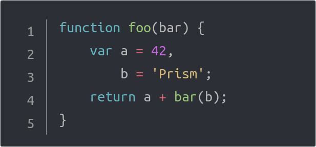

# Prism One Monokai

One Monokai theme for [prism.js](https://github.com/PrismJS/prism)

Based on [Vscode One Monokai theme](https://github.com/azemoh/vscode-one-monokai)


# Usage

Just include the theme's CSS file in your page.

Example:

```html
<!DOCTYPE html>
<html>
	<head>
		...
		<link href="prism-one-monokai.css" rel="stylesheet" />
	</head>
	<body>
		...
		<script src="prism.js"></script>
	</body>
</html>
```


#  Screenshot

